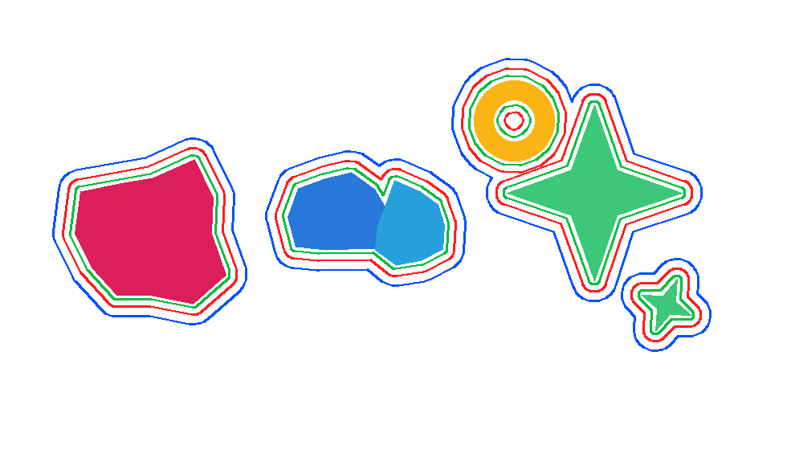
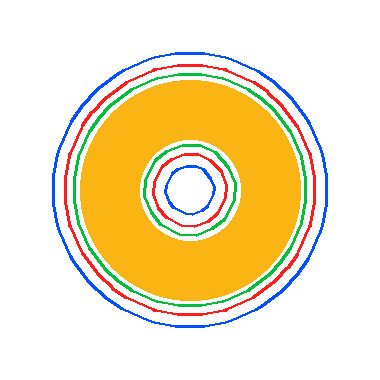
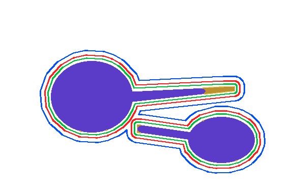

# CutLine Studio (프로토타입)

도안 이미지(PNG/JPG, 투명 배경) 또는 벡터 파일(SVG)을 넣으면 **세이프티 라인 / 칼선(cutting line) / 블리딩 라인**을
지정한 mm 간격만큼 자동으로 생성해주는 데스크톱 프로그램 프로토타입입니다.

문구/스티커 작가들이 실무에서 가장 시간을 많이 쓰는 작업 중 하나인 "도안 외곽선 따라 칼선 그리기"를
자동화해서, 그 시간을 다시 창작에 쓸 수 있게 하는 게 목표입니다.

MIT 라이선스로 공개합니다 — 포크, 이슈, PR 다 환영이에요. 개발 과정은 [`journal/`](./journal) 폴더에
일지 형태로 기록합니다.

## 데모

| 여러 도안 + 홀 처리 | 도넛 모양(홀) | 찢김/디테일 손실 위험 자동 감지 |
|---|---|---|
|  |  |  |

왼쪽부터: 서로 떨어진 도안은 개별 오프셋, 가까운 도안은 자동으로 하나로 합쳐짐 / 구멍 있는 도안 처리 /
얇은 촉수·좁은 목처럼 오프셋 폭보다 얇은 구간(노란색)을 자동으로 찾아 경고.

## 핵심 아이디어

1. 이미지의 알파 채널(또는 흰 배경)에서 도안의 실루엣을 추출 (OpenCV)
2. 실루엣을 지정한 mm만큼 바깥쪽으로 오프셋 (Shapely) — 세이프티 < 칼선 < 블리딩 순서로 3겹
3. 서로 가까운 도안 요소는 오프셋 시 자동으로 하나의 선으로 합쳐짐 (실제 인쇄소 작업 방식과 동일)
4. 구멍이 있는 도안(글자 "O" 등)도 정확히 처리됨
5. 일러스트레이터에서 바로 열리는 SVG로 내보내기 (레이어별 이름/색상 유지)

## 실행 방법

```bash
pip install -r requirements.txt
python gui/app.py
```

Windows에서는 tkinter가 기본 파이썬에 포함되어 있어 별도 설치가 필요 없습니다 (Mac/Linux는 python3-tk 필요할 수 있음).

## 사용 순서 (GUI)

1. "찾아보기"로 도안 파일 선택 (투명 PNG 권장, 또는 SVG)
2. 작업 DPI 설정 (인쇄용이면 보통 300)
3. 세이프티/칼선/블리딩 각각 mm 값 입력
4. "칼선 생성 / 미리보기" 클릭 → 오른쪽에 결과 미리보기 표시
5. "SVG로 내보내기" → 일러스트레이터에서 바로 열어 확인/인쇄소 제출

## 폴더 구조

```
core/           핵심 알고리즘 (이미지→실루엣, 오프셋 계산, SVG 출력, 미리보기 렌더링)
gui/app.py      Tkinter 데스크톱 앱
samples/        테스트용 샘플 이미지/SVG 생성 스크립트
output/         테스트 실행 결과물 (미리보기 PNG, SVG)
test_pipeline.py, test_vector.py   핵심 알고리즘 검증용 스크립트
```

## 지금까지 검증한 것

- 여러 개의 분리된 도안 요소 각각에 개별 오프셋 생성 ✅
- 가까이 붙은 두 도안이 오프셋 시 하나로 합쳐지는 것 ✅
- 구멍이 있는 도안(도넛 모양 등)의 홀 처리 ✅
- 벡터(SVG) 입력에서 곡선 및 evenodd 홀 규칙 처리 (내부적으로 고해상도 래스터화 후 동일 파이프라인 재사용) ✅
- 실제 GUI 앱 구동 및 생성→미리보기→SVG 내보내기 전체 플로우 ✅
- 오프셋 폭보다 얇은 디테일(찢김·밀림 위험 구간) 모폴로지 opening 기반 자동 감지 ✅
- 실제 인쇄 납품용 파일(CMYK, PDF 레이어 구조) 분석을 통한 색상/포맷 요구사항 확인 ✅

## 비슷한 프로젝트 (사전 조사)

시작 전에 겹치는 게 있는지 찾아봤습니다:

- [jsorscher1/sticker-cutline-generator](https://github.com/jsorscher1/sticker-cutline-generator) — MIT, 브라우저 기반(OpenCV.js + Clipper.js), 핵심 오프셋 원리는 동일. CMYK나 찢김 위험 감지는 없음.
- [stickerit.co](https://www.stickerit.co/tools/cutline-generator), [cutcontour.com](https://cutcontour.com/) — 상업 서비스(유료/크레딧제), 비공개 소스.
- [mathandy/svgpathtools](https://github.com/mathandy/svgpathtools) — SVG 패스 처리 파이썬 라이브러리.
- 국내 인쇄소(퍼블로그, 포토몬 등)의 "자동 칼선" 업로드 기능 — 해당 인쇄소 제출 시에만 사용 가능한 폐쇄형 기능.

자세한 조사 내용/날짜별 기록은 [`journal/2026-08-24.md`](./journal/2026-08-24.md) 참고.

## 알려진 제한 사항 / 다음 단계 (제품화 로드맵)

- **.ai 파일 직접 읽기**: PDF 호환 옵션으로 저장된 .ai 파일은 PyMuPDF로 직접 열어 레이어(OCG)·색상·벡터 패스까지 읽을 수 있는 것을 확인했습니다 (실제 인쇄 납품 파일로 검증). 다만 지금 코어 파이프라인에는 아직 연결하지 않았고, SVG 경로가 우선 구현되어 있습니다.
- **CMYK 출력 미지원**: 지금 SVG 내보내기는 RGB입니다. 실제 인쇄소는 CMYK가 기본이라, PDF(CMYK 네이티브) 내보내기로 바꾸는 게 다음 우선순위입니다.
- **곡선 스무딩 품질**: 현재는 Shapely의 round join으로 처리 중이라 대부분 매끄럽지만, 아주 날카로운 디테일(글자의 뾰족한 세리프 등)은 옵션 조정이 필요할 수 있습니다.
- **exe 패키징**: 지금은 `python gui/app.py`로 실행하는 방식입니다. PyInstaller로 더블클릭 실행 가능한 .exe로 패키징하는 건 다음 단계로 쉽게 가능합니다.
- **일러스트레이터 플러그인화**: 지금 로직을 ExtendScript(JSX)나 UXP 플러그인으로 옮기면 일러스트레이터 안에서 직접 실행되는 버전도 만들 수 있습니다.
- **UI 다듬기**: 지금은 기능 검증용 최소 UI입니다. 실제 판매 제품으로 가려면 드래그앤드롭, 여러 파일 일괄 처리(배치), 실행취소, 오프셋 곡률(join style) 옵션, 단위(mm/inch) 전환 등이 필요합니다.
- **정확한 mm 단위**: 벡터(SVG) 입력은 SVG 표준 96dpi 기준으로 mm를 환산합니다. 실제 아트보드가 다른 단위로 저장되어 있다면 결과가 어긋날 수 있어, 추후 "실제 크기(mm) 직접 입력" 옵션을 추가하는 게 좋습니다.

## 기여하기

이슈/PR 환영입니다. 개발 배경과 실무 조사 내용은 `journal/` 폴더에 날짜별로 쌓입니다 — 새로 합류하는 분은 거기서 맥락을 파악하시면 됩니다.

## 라이선스

[MIT](./LICENSE) — Copyright (c) 2026 멍푸 스튜디오
