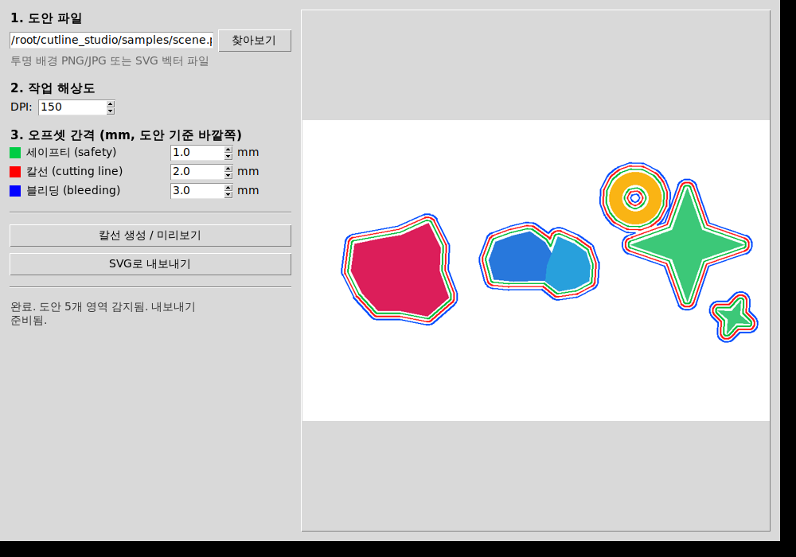
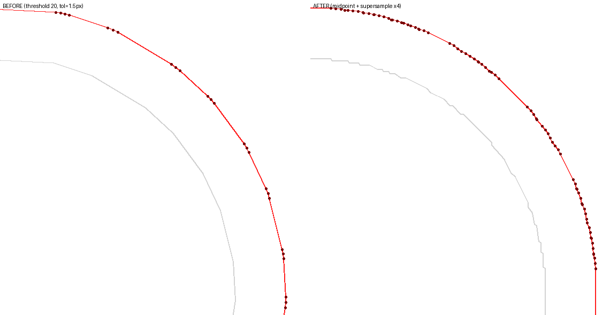
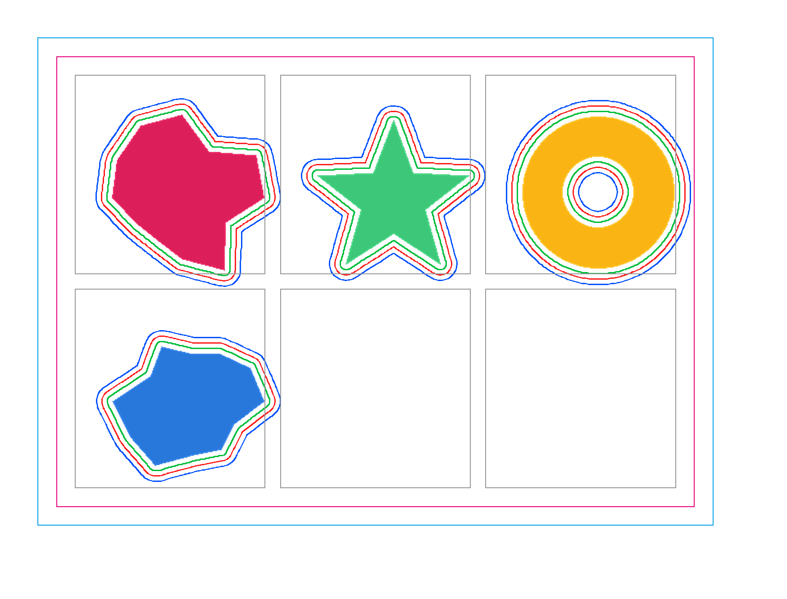

# CutLine Studio (프로토타입)

도안 이미지(PNG/JPG, 투명 배경) 또는 벡터 파일(SVG)을 넣으면 **세이프티 라인 / 칼선(cutting line) / 블리딩 라인**을
지정한 mm 간격만큼 자동으로 생성해주는 데스크톱 프로그램 프로토타입입니다.

문구/스티커 작가들이 실무에서 가장 시간을 많이 쓰는 작업 중 하나인 "도안 외곽선 따라 칼선 그리기"를
자동화해서, 그 시간을 다시 창작에 쓸 수 있게 하는 게 목표입니다.

MIT 라이선스로 공개합니다 — 포크, 이슈, PR 다 환영이에요. 개발 과정은 [`journal/`](./journal) 폴더에
일지 형태로 기록합니다.

## 데모



실제 데스크톱 앱 화면 — 도안을 불러와서 "칼선 생성/미리보기"를 누르면 오른쪽에 결과가 바로 표시됩니다.

| 여러 도안 + 홀 처리 | 도넛 모양(홀) | 찢김/디테일 손실 위험 자동 감지 |
|---|---|---|
|  |  |  |

왼쪽부터: 서로 떨어진 도안은 개별 오프셋, 가까운 도안은 자동으로 하나로 합쳐짐 / 구멍 있는 도안 처리 /
얇은 촉수·좁은 목처럼 오프셋 폭보다 얇은 구간(노란색)을 자동으로 찾아 경고.

### 칼선이 도안에 더 가까워짐 (2026-08-25)



왼쪽(이전) / 오른쪽(개선 후) — 안티에일리어싱된 원 도안 기준, 이론상 정확한 오프셋 위치와의 평균 오차가
0.47px → 0.24px로 절반 가까이 줄었습니다. 원인 분석과 실제 캐릭터 파일로의 검증 결과는
[`journal/2026-08-25.md`](./journal/2026-08-25.md) 참고.

### 도안 한 장이 아니라 시트 전체 (씰스티커 12칸 등) (2026-08-25)



실제 인쇄용 "가이드" 파일(용지 종류별 재단선/칼선/슬롯 배치가 그려진 템플릿)을 먼저 읽어서, 시트
전체 재단·칼선 경계선(파란색/자주색 큰 사각형)과 개별 도안 슬롯 칸(회색 사각형)을 자동으로 파악한 뒤,
여러 도안을 슬롯 순서대로 배치해서 시트 전체를 한 번에 칼선 작업합니다. 도안이 슬롯 경계를 넘어가면
가이드의 안내("이 선을 넘어가지 마세요")대로 조용히 줄이지 않고 그대로 경고합니다. 위 이미지는
합성(가짜) 가이드+도안으로 재현한 공개용 데모이고, 실제 인쇄 가이드 파일과 실제 캐릭터로 검증한 내용은
[`journal/2026-08-25.md`](./journal/2026-08-25.md)에 기록(파일 자체는 비공개 유지).

## 핵심 아이디어

1. 이미지의 알파 채널(또는 흰 배경)에서 도안의 실루엣을 추출 (OpenCV)
2. 실루엣을 지정한 mm만큼 바깥쪽으로 오프셋 (Shapely) — 세이프티 < 칼선 < 블리딩 순서로 3겹
3. 서로 가까운 도안 요소는 오프셋 시 자동으로 하나의 선으로 합쳐짐 (실제 인쇄소 작업 방식과 동일)
4. 구멍이 있는 도안(글자 "O" 등)도 정확히 처리됨
5. 일러스트레이터에서 바로 열리는 SVG로 내보내기 (레이어별 이름/색상 유지)
6. 도안과 가장 가까운 선이 2mm보다 가까워지면, 세이프티/칼선/블리딩 간격을 유지한 채로 세 선을 통째로
   밀어내 자동으로 최소 2mm를 확보 (인쇄/커팅 밀림으로 도안이 잘리는 것 방지 — 2026-08-25 실제 완성
   납품 파일 검토 후 1mm→2mm로 상향)
7. 여러 도안을 인쇄 가이드 슬롯에 배치할 때, 기본은 원본 크기 그대로 놓고 슬롯보다 크면 위반으로
   보고만 함 — **도안을 슬롯에 맞춰 몰래 축소하지 않음** (2026-08-26, 직접 피드백으로 재확정된 원칙).
   슬롯에 맞춰 자동으로 줄이고 싶으면 `auto_fit=True`를 직접 켜야 하고, 그렇게 켰을 때 실제로 줄어든
   경우엔 전/후 크기(mm)가 항상 결과에 함께 보고됨 — 성공/실패 여부와 무관하게 크기가 바뀐 사실 자체가
   드러나지 않는 경우는 없음
8. 이미 가이드 안에 정렬·배치된 실제 파일(.ai, PDF 호환)에도 원본 레이어·이미지 크기/해상도를 전혀
   건드리지 않고, 칼선만 담은 새 레이어를 추가로 얹을 수 있음 (`core/ai_layer_export.py`)
9. **칼선 종류 구분** — 도무송(정원형/타원형/정사각형/직사각형, 실무에서 가장 많이 쓰는 방식)과 완칼
   (도안 실루엣을 그대로 따라감) 중 골라서 생성 (`core/cutline_types.py`)
10. **유색/복잡한 배경에서도 영역만 골라 자동 분리** — 실제 씰스티커 작업은 거의 다 유색 배경 위에서
    진행되기 때문에, 이미지 전체에서 하나의 알파값/흰 배경을 찾는 대신 작가가 드래그로 지정한 영역
    안에서 GrabCut으로 그 도안만 배경과 분리 (`core/segmentation.py`)
11. 서로 다른 도안의 선이 2mm 이내로 가까워지면(자기 도안과의 최소 간격과는 별개로) 두 선을 하나로
    합쳐서 출력 — 실제로 그렇게 가까운 두 개의 별도 다이 라인은 현실적으로 자를 수 없음
12. 같은 도안이 시트에 반복되는 경우, 한 번만 정확하게 칼선을 만들고 나머지 반복 위치에는 그 결과를
    그대로 복사·재배치 — 반복마다 다시 배경 분리를 시도하다 생기는 미세한 차이를 원천 차단
    (`core/repeat_grid.py`)
13. 모든 칼선(도무송이든 완칼이든, 세이프티/블리딩까지)은 실제 이미지 경계(또는 지정한 칸/타일 경계)를
    넘지 않도록 항상 교집합으로 잘라냄 — 물리적으로 존재하지 않는 곳을 다이가 자를 수는 없으므로
14. 실제 파일에 칼선을 추가할 때는 기본적으로 **선 하나**(칼선)만 새 레이어로 추가 — 실제 완성 파일들의
    레이어 구조를 보면 세이프티/블리딩을 별도 레이어로 나누는 경우가 없었기 때문
15. **이미지 종류 옵션(실무 기본값)** — 유테(유색 배경 위 캐릭터: 실루엣을 GrabCut으로 분리해 바깥쪽
    1.5mm) / 무테(테두리 없이 셀을 꽉 채우는 이미지: 내용물 분석 없이 셀 경계 사각형을 안쪽으로
    1.5mm) 중 골라서 한 번에 생성 (`core/image_style.py`)
16. **유테/무테 자동 감지** — 드래그한 영역을 GrabCut으로 분리한 뒤, 그 모양의 "사각형도"(자기 자신의
    최소회전사각형 대비 실제 면적 비율)만 보고 유테(자유형 캐릭터, 낮음)인지 무테(이미 사각형/액자
    형태, 높음)인지 스스로 판단 — 실제 두 파일에서 임계값 0.85로 검증됨. 판정 후 실제 선은 항상 기존
    검증된 방식(무테는 드래그 영역 자체를 셀 경계로) 그대로 사용하고, 판정 근거(사각형도 수치)를 화면에
    그대로 보여줘서 틀렸을 때 바로 수동으로 바꿀 수 있음 (`core/style_classify.py`)
18. **소형 요소는 재검출이 확인상 불가능하면 실제 손그린 칼선 모양을 그대로 재사용** — 저대비
    패턴(체크무늬/줄무늬 등)이 그 자체 색과 거의 구분 안 되는 배경(마운트/받침) 위에 얹힌 소형 요소는
    GrabCut도, 강제 전경 시딩도, 순수 색상거리 임계값도 전부 진짜 바깥 경계를 못 잡는 것이 실측으로
    확인됨(사각형도/할로 판정 이전에 발생하는, 더 근본적인 문제) — 이미 칼선이 있던 시트를 다시 그리는
    경우엔 그 요소의 실제 손그린 칼선 폴리곤이 이미 파일 안에 있으므로, 재검출 대신 그 실제 모양을
    (모서리만 살짝 다듬어) 그대로 새 칼선으로 사용 (`core/interactive_cutline.py`의
    `generate_cutline_from_known_silhouette`)
19. **서로 다른 요소끼리 2mm 미만으로 가까워지면 자동 병합 — 최우선 규칙으로 명문화** — 개별 요소를
    따로 생성한 뒤 복제·배치까지 마친 시트 전체에 대해, 한 도안 내부 조각을 합칠 때 쓰던 것과 같은
    "간격의 절반만큼 바깥→안" 버퍼 트릭을 요소 간에도 그대로 적용 (`core/cutline_core.py`의
    `merge_close_elements`) — 이 프로젝트의 그 어떤 다른 규칙보다도 우선 적용되어야 하는 규칙
20. **기존 칼선의 실제 여백을 역산해서 측정** — 지금까지의 모든 기능이 "mm를 입력받아 칼선을 만드는"
    방향이라면, 이건 반대로 이미 그려진 칼선(손그림이든 업체가 준 견본 파일이든)에서 실제 여백이 몇
    mm였는지 되짚어 계산함. 인쇄 업체마다 요구하는 여백이 달라 파일마다 자로 하나하나 재던 작업을
    대신하기 위한 기능 (`core/ai_cutline_reader.py`로 실제 파일에서 칼선 좌표를 읽고,
    `core/margin_inspector.py`로 도안 경계까지의 거리를 mm로 측정, `inspect_cutline_margins.py`로
    파일 하나를 통째로 스캔해서 표로 출력)
21. **정밀도(업샘플 배율)를 이미지 크기에 맞춰 자동으로 낮춤 + GUI에서 직접 조정 가능** — 서브픽셀
    컨투어 추출은 이미지를 업샘플 배율만큼 확대해서 처리하므로 비용이 배율의 제곱 + 원본 해상도에 비례해
    커짐. 지금까지 실제로 다룬 파일들(4500px대 원본)은 그대로 기본 4배 정밀도를 유지하되, 그보다 훨씬
    큰 원본이 들어오면 처리 속도 보호를 위해 자동으로 배율을 낮추고, 낮아졌다는 사실을 결과 메시지에
    항상 표시함 (`core/cutline_core.py`의 `auto_supersample`). GUI "2. 작업 해상도"에 "정밀도(업샘플)"
    드롭다운을 추가해서, 자동 조정에만 맡기지 않고 원하면 직접 배율을 고를 수도 있음
22. **오프셋/여백 값에 안전 최소값을 강제 — 자유 입력이라도 너무 작은(또는 0인) 값이 그대로 통과되지
    않음** — 세이프티/칼선/블리딩 다단계 오프셋은 기존에도 최소 2mm(`MIN_GAP_MM`)가 강제됐지만, 유테/무테
    단일 간격(`style_margin_mm`) 경로에는 그런 보호가 없어서 0이나 그에 가까운 값이 그대로 쓰였음.
    실제 인쇄/커팅 밀림만으로도 칼선이 도안을 잘라먹을 수 있다는 실무 피드백(2026-08-26)에 따라, 이
    경로에도 별도의 최소값(`core/image_style.py`의 `MIN_STYLE_MARGIN_MM`, 0.5mm — 이 프로젝트가 실제
    파일들에서 측정한 가장 좁은 정당한 여백 기준)을 두어 그 밑으로는 자동으로 올리고, 올랐다는 사실을
    항상 결과에 표시함(다단계 경로의 최소-간격 자동 조정 표시와 동일한 방식)
23. **작업 종류(칼선 기준)를 완칼/스티커/도무송 세 갈래로 명확히 정립 + 여러 선택을 한 파일에 누적**
    (2026-08-26, 실무 피드백으로 재정립) — 이 프로젝트의 기본 원리는 항상 "도안 하나에 외곽선 하나를 그
    이미지의 실제 모양에 맞춰 만드는 것"이고, 그 "하나"가 무엇을 가리키는지로 작업 종류가 갈립니다.
    **완칼** = 이미지 단독 하나(또는 선택한 요소 하나)의 실제 실루엣을 그대로 따라가는 칼선. **스티커** =
    도안 안에서 드래그로 고른 요소 하나의 칼선(유테/무테 세부 옵션, 항목 15/16). **도무송** = 여백에 놓인
    다른 이미지 등을 정해진 5개 도형(사각형/정사각형/타원형/정원형/완칼) 중 하나로 재단(항목 9). GUI에서
    드래그 → 작업 종류/세부 옵션 선택 → "이 영역 추가"를 반복하면, 그 각각의 칼선이 전부 하나의 파일에
    누적됩니다(`core/accumulate.py`의 `combine_results`) — 이전에는 매번 "생성"을 누르면 직전 결과가
    통째로 대체되는 1회성 방식이었던 것을, 실제 작업 방식("여러 번 드래그 + 옵션 선택 → 전부 한 파일에
    누적")에 맞게 바꿨습니다. 서로 다른 작업 종류로 만든 요소들을 합칠 때도 항목 19의 최소 2mm 간격
    규칙이 그대로 재적용됩니다. 이와 함께 "선화"라는 이름은 "유테"(테두리 외곽선이 있는 이미지)로
    바꿔서, 무테(테두리 외곽선이 없는 이미지)와 짝을 이루는 더 단순하고 명료한 이름이 되도록
    정리했습니다(내부 로직은 이름만 바뀌었을 뿐 동일).
24. **무테 칼선이 실제 그림 안쪽으로 파고들 수 있는 경우를 감지해서 경고** (2026-08-26, 위 항목 23의
    검증용 예시 파일을 직접 보고 주신 피드백 "칼선 이탈과 중첩"으로 발견) — 무테는 원래 "작가가 드래그한
    선택 영역 자체를 안쪽으로 줄이는" 방식이라 실제 그림 내용을 보지 않는데, 그 선택 영역 자체가 실제
    그림 가장자리에 비해 여유(margin_mm)보다 좁게 잡히면, 안쪽으로 줄인 칼선이 실제 그림보다 더 안쪽으로
    들어가 버리는(=그림을 잘라먹는) 경우를 지금까지 아무도 확인하지 않고 있었습니다. 이제 무테 경로에서
    선택 영역 안의 실제 내용물 경계(전체 GrabCut이 아니라 알파/배경색 기준의 가벼운 측정만)를 확인해서,
    계산된 칼선이 그 경계보다 안쪽으로 들어가면 몇 mm나 침범하는지와 함께 자동으로 경고합니다(자동으로
    선택 영역을 넓히지는 않음 — 실제 슬롯/칸 사각형처럼 원래 그림보다 일부러 크게 잡힌 정당한 선택도
    있어서, 대신 다시 드래그하거나 간격을 줄이라고 안내). `core/image_style.py`의
    `_measure_content_bbox_px` + `generate_style_cutline`의 무테 분기에 추가.
25. **GUI 디자인 전면 개편 — 버튼이 화면 밖으로 잘리던 문제를 구조적으로 해결 + 최신 트렌드 반영**
    (2026-08-26, "ui 디자인이 너무 구리고 버튼 위치도 한쪽에 몰려서 화면에서 짤려... 무조건
    세련되고 고급지게" 피드백) — 항목 23의 작업 종류 재편으로 조작 패널 섹션이 8개로 늘면서, 기존
    `tkinter`/`ttk` 고정 높이 레이아웃에서는 창 크기와 무관하게 아래쪽 버튼(SVG 내보내기 등)이 화면
    밖으로 밀려 아예 눌리지 않는 문제가 있었습니다. `customtkinter`로 전면 교체하면서 왼쪽 조작
    패널 전체를 `CTkScrollableFrame`으로 감싸, 섹션이 몇 개든 창 높이가 얼마든 스크롤로 항상 모든
    버튼에 닿을 수 있도록 구조 자체를 바꿨습니다(더 이상 "잘림"이라는 상태 자체가 존재하지 않음).
    동시에 카드형 섹션(둥근 모서리 + 옅은 테두리), 단일 브랜드 컬러(인디고 `#4338CA`)를 쓰는
    1차(강조 채움)/2차(아웃라인) 버튼 위계, 여유로운 여백과 통일된 타이포그래피(맑은 고딕)로 시각
    언어를 새로 그렸습니다. 세이프티/칼선/블리딩의 색상 스와치처럼 기존의 실무적 신호(초록/빨강/파랑)는
    그대로 유지하되 톤만 다듬었습니다. 상태 변수 이름/타입과 모든 비즈니스 로직 메서드(`_generate_one_item`,
    `_run_generate`, `_validate_inputs` 등)는 전혀 건드리지 않아, 화면이 그려지는 방식만 바뀌었을 뿐
    동작은 100% 동일합니다 — `test_accumulate.py`를 포함한 기존 회귀 테스트 전부가 수정 없이 그대로
    통과함으로 확인.
26. **디자인 세부 조정 + 주 입력 파일을 어도비 일러스트(.ai)로 + 설치 후 첫 실행 튜토리얼**
    (2026-08-26, 항목 25에 이은 추가 피드백: "화면이 너무 크고 글자가 작아 폰트 0.8 포인트 키우고 파일은
    ... 어도비 일러스트 파일과 png,jpg 세가지 선택지로 만들고 ... 주 입력 파일은 어도비 일러스트야 ...
    버튼도 더 라운딩 넣고 크기 10mm 키워 ... 설치 후 첫 화면에 튜토리얼을 자동으로 뛰우고 ... 화면비율도
    1:2로 맞춰") — 다섯 가지를 한 번에 반영했습니다. **① 폰트**: 모든 글자 크기에 0.8포인트를 더함
    (반올림 적용, 예: 본문 13→14). **② 창 크기/비율**: 확인 결과 "가로로 넓은 2:1"을 의미하신 것으로
    확정 후, 기존 1180×800에서 더 작고 2:1 비율인 1000×500으로 축소(좌/우 나란히 배치 구조는 그대로).
    **③ 버튼**: 실제 클릭 버튼(1차/2차)의 둥근 정도를 키우고, 높이에 10mm를 96dpi 환산(~38px)해서 더함
    (`BUTTON_SIZE_BUMP_PX`). **④ 파일 형식 + 주 입력 파일**: "1. 도안 파일" 선택창을 어도비
    일러스트(.ai, 맨 앞 기본 필터)/PNG/JPG 세 가지로 좁힘. 신규 `core/ai_import.py`가 .ai 파일 안에
    이미 심겨 있는 실제 인쇄용 이미지를 그대로 추출(해상도 그대로, 다시 렌더링하지 않음)하고, 심겨 있는
    이미지가 없는 순수 벡터 파일이면 지정한 DPI로 페이지 자체를 래스터화하는 것으로 자동 대체 — 추출/
    변환된 결과는 이후 기존 GrabCut/드래그 선택 파이프라인을 PNG/JPG와 완전히 동일하게 그대로 탑니다.
    내보내는 SVG의 기본 파일명은 (내부 임시 래스터 경로가 아니라) 원래 고른 .ai 파일 이름을 그대로 씀.
    **⑤ 튜토리얼**: 설치 후 첫 실행 시 사용법 6단계를 요약한 대화상자가 자동으로 뜨고, "다시 보지 않기"
    체크박스를 켠 채로 닫으면 그 설정이 저장소(git) 밖 사용자 홈 폴더(`~/.cutline_studio/config.json`)에
    저장되어 다음부터는 뜨지 않음(앱 파일을 업데이트해도 이 설정은 영향받지 않음).
27. **진짜 .exe 파일 + 흑백/코발트 블루 브랜드 컬러 + 전용 아이콘** (2026-08-26, "exe 앱 디자인도 세련되고
    고급지게 해 ... 컬러도 흑백과 코발트 블루로 변경") — "exe 앱 디자인"이 정확히 무엇을 뜻하는지(아이콘만
    바꾸는 것인지, 실제 .exe 파일을 새로 만드는 것인지) 확인 질문을 드려 "진짜 .exe 파일로"를 확정한 뒤
    반영했습니다. **① 컬러**: 브랜드 포인트 컬러를 인디고에서 코발트 블루(`#0047AB`)로 바꾸고, 배경/테두리/
    글자색을 전부 흑백·그레이 톤으로 정리(`gui/app.py`의 팔레트 상수 블록). 세이프티/칼선/블리딩 색상
    스와치(초록/빨강/파랑)는 인쇄 실무의 기능적 신호라서 장식용 브랜드 컬러와 구분해 그대로 둠. **② 전용
    아이콘**: 신규 `assets/make_icon.py`가 코발트 블루 바탕에 흰색 점선 칼선 + 컷 포인트를 그린 브랜드
    마크를 PNG/멀티사이즈 ICO로 생성(`assets/app_icon.png`, `assets/app_icon.ico`), `gui/app.py`가 실행
    시 창/작업표시줄 아이콘으로 지정. **③ .exe 빌드**: 신규 `exe_빌드.bat`(기존 `설치_및_실행.bat`과
    같은 스타일 -- 진짜 Python 확인 → 패키지 설치 → 아이콘 생성 → `PyInstaller`로 `dist\CutLine
    Studio.exe` 생성 → 완성되면 탐색기로 폴더 열기)을 실행하면 Python 설치 없이 더블클릭만으로 실행되는
    단일 실행 파일이 만들어집니다. `gui/app.py`에 `_resource_dir()`을 추가해 일반 실행과 PyInstaller로
    묶인 실행(파일들이 매번 새 임시 폴더에 풀리는 방식) 양쪽에서 아이콘 등 리소스 경로가 똑같이 올바르게
    찾아지도록 함. PyInstaller는 새 `requirements-build.txt`에만 넣어(일반 사용자의 평소 설치에는 영향
    없음, 빌드할 때만 필요).

## 실행 방법

**Windows, 터미널 없이 간편하게**: 이 폴더의 `설치_및_실행.bat` 파일을 더블클릭하세요. Python이 없으면
설치 안내를, 있으면 필요한 패키지를 자동으로 설치하고 바로 프로그램을 실행합니다(패키지는 이미 설치되어
있으면 다시 설치하지 않고 넘어가므로, 다음부터도 그냥 이 파일만 더블클릭하면 됩니다). Python 자체가 없다면
[python.org](https://www.python.org/downloads/)에서 3.10 이상을 내려받아 설치할 때 **"Add python.exe to
PATH"에 체크**만 하면 됩니다(tcl/tk는 기본 설치에 보통 포함되어 있어 따로 설치할 필요 없음).

**터미널을 직접 쓴다면**:

```bash
pip install -r requirements.txt
python gui/app.py
```

Windows에서는 tkinter가 기본 파이썬에 포함되어 있어 별도 설치가 필요 없습니다 (Mac/Linux는 python3-tk 필요할 수 있음).

**2026-08-26부터 실행하려면 라이선스 키가 필요합니다** (개인용/기업용 구분, 자세한 내용은 아래
"라이선스 활성화 시스템" 절 참고). 처음 실행하면 정상 화면 대신 라이선스 키 입력 화면이 뜹니다.

**진짜 .exe 파일로 만들기(선택 사항)**: Python 설치 자체가 없는 다른 컴퓨터에서도 더블클릭 하나로 바로
실행되게 하고 싶다면, `설치_및_실행.bat`을 한 번 실행해 패키지를 설치한 다음 이 폴더의 `exe_빌드.bat`을
더블클릭하세요. 몇 분 뒤 `dist` 폴더 안에 `CutLine Studio.exe` 하나가 만들어지고, 이 파일 하나만 원하는
곳(바탕화면 등)에 복사해두면 그 컴퓨터에 Python이 없어도 실행됩니다. 처음 실행할 때는 실행 파일이 스스로
압축을 푸는 과정 때문에 몇 초 정도 걸릴 수 있습니다.

## 사용 순서 (GUI)

0. **(선택 사항)** 도안 여러 장을 한 시트로 작업하고 싶다면: "0. 가이드 + 여러 도안 → 시트 합성"에서
   가이드 파일과 도안 파일들을 고르고 "시트 합성 미리보기" 클릭 → 합성된 시트 이미지가 자동으로
   "1. 도안 파일"에 채워짐 (이후 단계는 파일 하나 작업할 때와 동일). 슬롯보다 큰 도안은 기본적으로
   줄이지 않고 위반으로만 알림 — 자동으로 줄이려면 "슬롯보다 크면 자동 축소" 체크박스를 직접 켜야
   하고, 켰을 때 실제로 줄어들면 전/후 크기가 항상 함께 보고됨
1. "찾아보기"로 도안 파일 선택 (투명 PNG, 흰 배경, 또는 유색/복잡한 배경 파일도 가능, 또는 SVG) —
   0번에서 시트를 합성했다면 이 단계는 생략됨
2. 작업 DPI와 정밀도(업샘플 배율, 기본 4x — 도안이 아주 크면 자동으로 낮아질 수 있음) 설정
3. **"3. 작업 종류"에서 완칼 / 스티커 / 도무송 중 하나를 고름** — 완칼은 이미지(또는 선택 요소) 하나의
   실제 실루엣을 그대로, 스티커는 도안 안 요소 하나(유테/무테), 도무송은 선택 영역을 5개 도형 중 하나로
   재단
4. 완칼/도무송을 골랐다면 "4. 오프셋 간격"에 세이프티/칼선/블리딩 mm 값을 입력. 스티커를 골랐다면
   "5. 스티커 세부 옵션"에서 자동 감지/유테/무테와 간격(mm)을 입력
5. **(스티커·도무송은 필수, 완칼은 선택 사항)** 오른쪽 미리보기 위에서 칼선을 만들고 싶은 부분을 마우스로
   드래그해서 영역 지정 — 대충 드래그해도 됨 (정확한 윤곽은 자동으로 찾음). 완칼에서 아무 것도 드래그하지
   않으면 이미지 전체에 적용됨
6. 도무송을 골랐다면 "6. 도무송 세부 옵션"에서 도형(완칼/직사각형/정사각형/타원형/정원형) 선택
7. **"이 영역 추가 + 미리보기"** 클릭 → 오른쪽에 결과 미리보기 표시 (오프셋/정밀도가 안전 최소값
   미만이었거나 자동으로 조정된 경우 완료 메시지에 항상 표시됨)
8. **더 추가하고 싶다면**: "원본 다시 보기"를 눌러 다시 드래그 → 작업 종류/세부 옵션을 바꿔서 7번을
   반복 — 매번 직전 결과를 대체하는 게 아니라, 지금까지 추가한 모든 영역이 하나의 파일에 그대로
   누적됩니다("7. 누적" 영역에 누적 개수가 표시됨). 잘못 추가했다면 "누적 초기화"로 전부 지우고 다시
   시작
9. "SVG로 내보내기" → 일러스트레이터에서 바로 열어 확인/인쇄소 제출 (지금까지 누적된 모든 영역의
   칼선이 한 파일에 함께 저장됨)

## 라이선스 활성화 시스템 (2026-08-26)

개인용/기업용 라이선스를 구분해서 발급하고, 위반 시 원격으로 잠글 수 있는 시스템입니다.

- **개인용 라이선스**: 기기 대수를 강제로 막지는 않지만, 활성화할 때마다 기기 지문/IP/시각이 서버에
  기록됩니다 — 개인용으로 사서 기업이 돌려 쓰는 정황을 나중에 확인하고 필요하면 대응하기 위한
  근거 자료입니다.
- **기업용 라이선스**: 계약된 대수(좌석)를 넘는 기기가 새로 접속을 시도하면, 그 즉시 이미 쓰던 기기를
  포함해 **그 라이선스 전체가 잠깁니다**. 이후에는 재활성화 코드가 있어야 다시 쓸 수 있습니다.
- **완전 잠금 + 재활성화 키**: 언제든 특정 라이선스를 즉시 잠글 수 있고, 잠긴 라이선스는 1회용
  재활성화 코드를 받아 입력해야 풀립니다. 잠기면 화면 자체가 정상 화면 대신 잠금 화면으로 바뀝니다
  (버튼만 비활성화하는 방식이 아니라, 정상 화면을 아예 그리지 않는 구조적 잠금).

이 저장소(`core/license_client.py`)에는 **서버의 공개키만** 들어 있어서, 파일을 열어봐도 라이선스를
위조할 방법은 없습니다. 실제 라이선스 발급/잠금/재활성화 관리자 도구와 서버 코드, 그리고 서명용
개인키는 보안을 위해 **별도의 비공개(private) GitHub 저장소(cutline_license)**에서 따로 관리합니다
(공개 저장소에 라이선스 검증 로직 전체가 노출되면 우회 방법을 찾기 쉬워지기 때문). 그 저장소는
GitHub 대신 대화창을 통해 따로 전달드렸습니다 — 배포 방법과 관리자 도구 사용법은 그 안의
`README.md`에 있습니다.

솔직한 한계도 적어둡니다: 앱 실행 파일(.exe) 안에는 이 확인 로직 자체가 어차피 들어가야 하므로,
아주 작정하고 실행 파일을 크랙하려는 사람까지 100% 막을 수는 없습니다. 이 시스템이 실제로 보장하는
것은 (1) 모든 활성화 시도가 기기 지문/IP/시각과 함께 서버에 기록되어 나중에 증거로 쓸 수 있다는 것,
(2) 크랙 없이 정상적으로 접속하는 기업 라이선스가 좌석 수를 넘기면 그 즉시 잠긴다는 것입니다 —
"뚫리지 않는 DRM"이 아니라 억제력과 증거 확보 수단으로 봐주시는 게 정확합니다.

## 폴더 구조

```
core/           핵심 알고리즘 (이미지→실루엣, 오프셋 계산, SVG 출력, 미리보기 렌더링)
core/guide.py         인쇄 가이드(.ai/PDF) 파일에서 시트 경계/슬롯 칸 읽어오기
core/sheet_layout.py  여러 도안을 가이드 슬롯에 배치해 시트 전체 합성 이미지 생성 (기본: 슬롯에 맞게 자동 축소)
core/ai_layer_export.py  기존 .ai(PDF 호환) 파일에 원본을 안 건드리고 칼선만 새 레이어로 추가
core/cutline_types.py    칼선 종류(도무송 4종/완칼) 정의 및 도형 생성
core/segmentation.py     유색/복잡한 배경에서 드래그한 영역 안의 도안만 GrabCut으로 분리
core/interactive_cutline.py  영역 선택 + 칼선 종류 + 오프셋을 하나로 묶는 진입점 (GUI가 호출)
core/image_style.py      유테/무테 실무 기본 옵션 (각각 1.5mm, 바깥쪽/안쪽)
core/style_classify.py   드래그한 도안의 분리된 모양(사각형도)만 보고 유테/무테를 자동 판정
core/ai_cutline_reader.py  실제 .ai 파일의 칼선레이어에서 이미 그려진 칼선 좌표를 그대로 읽어옴 (읽기 전용)
core/margin_inspector.py   이미 있는 칼선이 도안 경계로부터 실제로 몇 mm 떨어져 있는지 역산
core/slip_margin.py      실측된 기존 칼선의 편차(std)를 근거로 인쇄/커팅 밀림 예상 범위를 계산해 여백에 반영
core/image_placement.py  이미지 배치가 회전되어 있어도 픽셀↔페이지좌표를 정확히 변환 (PyMuPDF 행렬 그대로 사용)
core/repeat_grid.py      같은 도안이 반복되는 시트에서 칼선을 한 번만 만들고 나머지에 복사·재배치 (평행이동/회전 배치 모두 지원)
core/cutline_core.py의 merge_close_elements()  서로 다른 도안의 칼선끼리 2mm 미만으로 가까워지면 하나로 병합 (compute_offsets가 한 도안 내부에서 쓰는 것과 같은 트릭을 요소 간에 적용)
core/interactive_cutline.py의 generate_cutline_from_known_silhouette()  픽셀 재검출이 불가능하다고 확인된 소형 요소에서, 이미 알고 있는 실제 칼선 폴리곤을 모서리만 다듬어 그대로 재사용
core/accumulate.py       완칼/스티커/도무송 등 서로 다른 작업 종류로 만든 여러 CutlineResult를 하나로 합침 (누적, 최소 2mm 간격 재적용)
core/ai_import.py        어도비 일러스트(.ai) 파일을 GUI의 주 입력으로 사용 -- 심겨 있는 실제 인쇄용 이미지를 그대로 추출(없으면 지정 DPI로 페이지를 래스터화)
gui/app.py      customtkinter 데스크톱 앱 (도안 파일: 어도비 일러스트/PNG/JPG, 작업 종류(완칼/스티커/도무송) 선택 + 영역 드래그 선택 + 누적 방식, 설치 후 첫 실행 튜토리얼)
samples/        테스트용 샘플 이미지/SVG/PDF 생성 스크립트
output/         테스트 실행 결과물 (미리보기 PNG, SVG)
test_pipeline.py, test_vector.py, test_sheet_demo.py   핵심 알고리즘 검증용 스크립트
test_accumulate.py   완칼/스티커/도무송 작업 종류 + 누적(combine_results) + 어도비 일러스트 입력 워크플로우 검증 (Tkinter 필요 -- python3.12 + xvfb-run 예시: `xvfb-run -a python3.12 test_accumulate.py`)
test_ai_import.py   core/ai_import.py 단독 검증 (임베디드 이미지 추출 / 벡터 페이지 래스터화 폴백)
inspect_cutline_margins.py   실제 .ai 파일 하나를 열어 모든 칼선의 실제 여백(mm)을 표로 출력하는 CLI
assets/make_icon.py     흑백+코발트 블루 브랜드 아이콘(창/작업표시줄/exe 아이콘) 생성
core/license_client.py   개인/기업 라이선스 활성화 확인 클라이언트 -- 서버의 공개키만 들고 있고(비밀키는
                         절대 없음), 앱 시작 시 서버에 확인하고 짧은 오프라인 유예 기간(기본 3일)을 둠.
                         서버/발급-잠금-재활성화 관리자 도구는 보안을 위해 별도 비공개 저장소
                         (cutline_license)에 있음 -- 자세한 내용은 이 문서의 "라이선스" 절 참고
test_license.py          core/license_client.py를 로컬 테스트 서버에 대해 검증 (개인/기업 라이선스,
                         좌석 초과 잠금, 재활성화, 위조 토큰 거부 등)
설치_및_실행.bat   Windows에서 터미널 없이 더블클릭만으로 패키지 설치 + GUI 실행
exe_빌드.bat        Python 설치 없이도 더블클릭으로 실행되는 dist\CutLine Studio.exe 빌드
requirements-build.txt   exe 빌드에만 필요한 도구(PyInstaller) -- 평소 실행에는 불필요
```

## 지금까지 검증한 것

- 여러 개의 분리된 도안 요소 각각에 개별 오프셋 생성 ✅
- 가까이 붙은 두 도안이 오프셋 시 하나로 합쳐지는 것 ✅
- 구멍이 있는 도안(도넛 모양 등)의 홀 처리 ✅
- 벡터(SVG) 입력에서 곡선 및 evenodd 홀 규칙 처리 (내부적으로 고해상도 래스터화 후 동일 파이프라인 재사용) ✅
- 실제 GUI 앱 구동 및 생성→미리보기→SVG 내보내기 전체 플로우 ✅
- 오프셋 폭보다 얇은 디테일(찢김·밀림 위험 구간) 모폴로지 opening 기반 자동 감지 ✅
- 실제 인쇄 납품용 파일(CMYK, PDF 레이어 구조) 분석을 통한 색상/포맷 요구사항 확인 ✅
- 서브픽셀 컨투어 추출(업샘플+중간값 재이진화)로 곡선/대각선 구간 칼선 정밀도 개선, 실제 캐릭터 파일로 검증 ✅
- 도안과 가장 가까운 선 사이 최소 2mm 간격을 항상 자동 보장(인쇄/커팅 밀림으로 도안이 잘리는 것 방지) ✅
- 인쇄 가이드 파일(재단/칼선/슬롯 배치)을 먼저 읽어서 그 기준대로 여러 도안을 시트 전체에 배치(기본:
  슬롯에 맞춰 자동 축소)하고 칼선 생성, 슬롯 경계 위반 자동 감지 ✅
- 실제 완성 납품 파일(원본 레이어 구조: 가이드라인/개별재단 레이어/칼선레이어/인쇄레이어)을 그대로 열어
  사본에 칼선 레이어만 추가 — 원본 이미지 크기·해상도·기존 레이어 6개가 바이트 단위로 그대로임을 확인 ✅
- 실제 작가가 손으로 그린 기존 칼선(자주색, 106개 패스)과 자동 생성 칼선을 같은 실제 파일 안에서 직접
  비교 — 기존 칼선의 실제 여백(예: 사각 다이컷 기준 약 3.6mm)과 자동 생성 결과의 여백(2mm 이상)을 수치로
  확인 ✅
- 도무송 4종(정원형/타원형/정사각형/직사각형)과 완칼을 같은 실제 도안에 각각 적용, 형태가 맞게 나오는
  것 확인 ✅
- 유색/복잡한 배경(하늘 그라데이션 + 여러 캐릭터가 겹친 실제 씰스티커 장면) 위에서, 드래그 선택 +
  GrabCut으로 캐릭터 하나만 분리 — 작가가 손으로 그린 실제 칼선과 비교해 IoU 0.80 (겹치는 비율, 첫
  시도 기준) 확인. 체계적으로 살짝 바깥쪽으로 큰 경향이 있음 — 정직한 한계와 다음 개선 방향은
  `journal/2026-08-25.md` 참고 ✅ (개선 여지 있음)
- 같은 장면이 반복되는 실제 시트에서, 한 곳에서 분리한 칼선을 나머지 5곳에 그대로 복사·재배치 — 6곳
  전부에서 실제 손그린 칼선과의 IoU가 0.7989~0.7997로 거의 동일 (반복 배치가 정확히 들어맞음을 확인) ✅
- 서로 다른 요소의 선이 2mm 이내로 가까워지면 하나로 합치는 기능 — 실제 도안 기준 8개였던 세이프티
  영역이 3개로 정리되는 것 확인 (겹치는 작은 루프가 사라짐) ✅
- 유테/무테 자동 감지 — 서로 다른 두 실제 파일(2조수희 유광코팅, 3조수희 인델눈송이)의 자유형 캐릭터
  3개(라쿤/강아지/스케이트보드 곰)와 액자형 도안 1개(회색 상자 곰)를 자동 판정시켜 전부 정답, IoU
  0.63~0.88 확인. 배경색이 옅어 GrabCut이 배경 채우기까지 못 잡는 액자형 도안(재사용 토끼 모서리)에서는
  자동 판정이 틀리는 것도 실측으로 확인 — 이 경우 수동 전환으로 정확하게 처리됨 (정직한 한계, 자세한
  수치는 `journal/2026-08-25.md` 참고) ✅ (일부 케이스 개선 여지 있음)
- 기존 칼선 여백 역산 측정 — 서로 다른 두 실제 파일에서, 작은 도안류(꽃/이파리 등)는 중앙값 1.2~1.7mm로
  실무 표준(1.5mm)과 잘 맞고, 다른 파일의 라쿤 캐릭터는 중앙값 2.6~3.4mm로 파일마다 실제 여백이 다르다는
  것도 수치로 확인 ✅ (같은 GrabCut 저대비 한계가 있는 도형은 편차(std) 수치로 스스로 "이건 눈으로 다시
  확인하라"고 표시함)
- 세 번째 실제 파일(캐릭터마다 흰색/민트색 테두리가 그려진 스타일, 알록달록한 물방울 배경)로 자동
  감지·여백 측정 재검증 — 캐릭터류 29개 도형 전부 중앙값 1.0~1.3mm, 편차 0.3~0.7mm로 지금까지 중 가장
  안정적으로 측정됨(테두리가 이미 그려진 도안일수록 오히려 GrabCut이 경계를 더 잘 잡는다는 것도 확인).
  같은 파일 안에서도 텍스트 라벨류(0.55~0.72mm)와 캐릭터류(1.0~1.3mm)의 실제 여백 관행이 다르다는 것도
  구분해냄 ✅. 저대비 배경(토끼 모서리 액자)에서의 한계는 세 번째 파일에서도 동일하게 재현됨 — 새로운
  문제가 아니라 이미 알려진 한계임을 재확인
- 네 번째 실제 파일(5조수희_인델별, 이미지 2장 + 90도 회전 배치 포함)로 **시트 전체** 칼선 재생성 —
  타일 12개 요소를 자동 감지+생성 후 실제 배치 행렬(회전 포함)로 7곳에 정확히 투영, 회전된 인스턴스도
  방향이 정확히 맞물림을 육안 비교로 확인 ✅. 기존 칼선의 실측 편차(표준편차)를 근거로 밀림 예상 여백을
  계산해서 적용(1.5mm 기본 + 최대편차(0.76mm) = 2.26mm) ✅ (단일 파일 12개 표본 기준 — 다음 파일들로
  계속 검증 필요)
- 위 결과물에 대한 작가 실사용 피드백으로 첫 시도가 탈락 → 원인이 GrabCut 노이즈(작은 구멍/파편, 전체
  도안 대비 1% 미만)가 그대로 버퍼링되어 "이중 칼선"으로 보인 것임을 재세그멘테이션으로 직접 확인하고,
  상대 면적 기준 필터(`core/cutline_core.py`, `core/segmentation.py`)로 제거 ✅. 여백도 실측 근거로
  절반 가까이 좁히고(3.02mm→2.26mm), 메인 버퍼 전 사전 스무딩을 추가해 뾰족한 돌기도 줄임 ✅
- 토끼 모서리는 도무송 여부/형태를 자동 판정하지 않고 작가님께 직접 확인(사각형 도무송) 후 적용 —
  12개 타일 요소(7곳 복제)+토끼 1개=85개로 실제 파일의 손그린 칼선 개수와 정확히 일치 ✅
- 작은 액자형 장식 2개가 사각형도 점수만으로 무테 오판정되어 칼선이 스티커 안쪽으로 파고드는 오류를
  작가님이 직접 발견 → 세그멘트 내용과 선택 영역 사이 실제 할로(여백) 유무를 사각형도보다 먼저 확인하는
  "할로 우선 판정"을 추가해 수정, 재검증 완료 ✅
- 그래도 작은 소품류(패턴 조각)는 여전히 그림 안쪽으로 파고듦 → 근본 원인은 판정 방식이 아니라 이런
  소품엔 GrabCut 실루엣 개념 자체가 안 맞는다는 것(저대비 반복 패턴이라 세그멘테이션이 진짜 인쇄
  경계보다 작게 잡힘) → 선택 영역 긴 변이 기준(기본 20mm) 이하면 실루엣 없이 선택 사각형 자체를 그대로
  트리밍하는 경로(`small_element_max_dim_mm`) 추가, 재검증 완료 ✅
- 위 사각형 트리밍도 작가님이 다시 반려 — 소형 요소는 네모가 아니라 실제 이미지 모양대로 나와야 하고,
  네모 칼선이 옆 큰 요소 칼선과 겹치는 문제도 있었음 → 원본 손그린 칼선과 직접 겹쳐 비교해 진단한 결과,
  이 소품류는 알록달록한 패턴이 자기 색과 실측상 구분 불가능한(GrabCut/강제 시딩/색상거리 세 가지 방법
  모두 확인) 연한 마운트 위에 얹혀 있다는 것을 확인 → 재검출 대신 이미 파일에 있는 그 요소의 실제 칼선
  폴리곤을 그대로 재사용(`generate_cutline_from_known_silhouette`)하도록 변경, 겹침 렌더링으로 실제
  모양과 정확히 일치함을 확인 ✅
- 서로 다른 요소의 칼선이 2mm 미만으로 가까워지는 경우를 이번 라운드 전까지는 검사한 적이 없었다는 것도
  같은 반려에서 확인 → 복제·배치까지 끝난 시트 전체에 최소 간격 강제(`merge_close_elements`)를 한 번
  적용해 85개→78개(실제로 서로 맞닿을 만큼 가까운 두 캐릭터 7쌍이 정확히 병합됨, 직접 거리 측정으로
  확인)로 정리, 겹침 없음을 육안으로 재확인 ✅
- 도구 자체의 안전장치 4건에 대한 실무 피드백(2026-08-26) 반영 및 검증 — (1) 슬롯 자동 축소를
  다시 기본 OFF로 되돌리고, 공개 데모 픽스처(`samples/guide_demo.pdf` + `samples/scene.png`, 슬롯보다
  가로로 큰 도안)로 기본값은 위반만 보고하고 `auto_fit=True`일 때만 실제 축소되며 전/후 크기(65.2×26.5mm
  → 33.7×13.7mm, 52%)가 항상 함께 보고되는 것을 직접 실행해 확인. (2) `auto_supersample`이 지금까지
  실제로 다룬 파일 크기(4495×3074 등)는 그대로 4배를 유지하고 훨씬 큰 이미지(가로/세로 6000px 이상)만
  자동으로 낮추는 것을 여러 크기로 직접 계산해 확인. (3) GUI에 정밀도 드롭다운 연결. (4) 유테/무테 단일
  간격에 없던 최소값 보호(`MIN_STYLE_MARGIN_MM`)를 공개 데모 픽스처(`samples/ring.png`)로 0mm 입력 시
  0.5mm로 자동 조정되고 1.5mm처럼 이미 안전한 값은 그대로 통과되는 것을 직접 실행해 확인 ✅
- "가이드 파일 + 도안 여러 장"을 GUI에서 한 번에 다루는 기능을 스크립트 레벨에서 GUI로 연결 —
  `gui/app.py`에 시트 합성 섹션을 추가해, 합성 결과가 곧바로 기존 단일-파일 파이프라인(오프셋/스타일/
  칼선 종류/내보내기)의 입력이 되도록 연결. 기존 단일-파일 경로는 전혀 변경하지 않아 회귀 없음 ✅
- 완칼/스티커/도무송 작업 종류 재정립 + 누적 워크플로우(2026-08-26) — 공개 데모 픽스처
  (`samples/ring.png`, `samples/scene.png`)로 헤드리스 환경(Xvfb)에서 실제 `gui/app.py` 클래스를 직접
  구동해 검증: (1) 완칼(전체 이미지)은 safety/cut/bleed 3단 전부 생성, (2) 스티커/유테와 스티커/무테는
  각각 cut 1단만 생성, (3) 도무송/정원형은 3단 전부 생성 — 세 가지를 각각 다른 영역에 적용한 뒤
  `core/accumulate.py`의 `combine_results`로 한 파일에 합쳐서 safety/cut/bleed 태그가 올바르게 합쳐짐을
  확인. 서로 다른 작업 종류로 만든 요소끼리도 최소 2mm 간격이 유지됨을 실제 폴리곤 간 거리 계산으로
  직접 확인(측정값이 여유를 두고 기준치 이상). 합쳐진 결과를 `export_svg`/`render_preview`에 그대로
  통과시켜 파일이 정상적으로 만들어지는 것도 확인, 미리보기 이미지를 육안으로도 재확인(세 작업 종류의
  칼선이 한 이미지 안에 동시에 표시됨) ✅. `ImageStyle.LINE_ART.value`가 "유테"로 바뀐 것도 같은
  스크립트에서 직접 확인 ✅
- 위 검증용 예시 파일을 실제로 열어보신 뒤 "칼선 이탈과 중첩"으로 직접 지적해주신 문제 재현/수정 —
  원인은 무테(BORDERLESS) 항목의 테스트용 선택 영역 padding(15px)이 dpi=300에서의 안쪽 margin_mm
  변환값(~17.7px)보다 좁아서, 계산된 칼선이 실제 그림 오른쪽 끝보다 더 안쪽으로 들어가 있었던 것 —
  같은 도형에 padding을 좁게(3px) 다시 재현해 실제로 그림을 침범하는 것을 수치로 재확인. 재발 방지로
  `core/image_style.py`에 무테 전용 안전 검사(`_measure_content_bbox_px`)를 추가해, 계산된 칼선이 알파/
  배경색 기준으로 측정한 실제 내용물 경계보다 안쪽으로 들어가면 몇 mm나 침범하는지 자동으로 경고하도록
  함. 같은 도형으로 (a) 넉넉한 padding(20px, margin 대비 충분)에서는 경고가 뜨지 않고, (b) 일부러 너무
  좁은 padding(3px)에서는 경고가 정확히 뜨는 것을 `test_accumulate.py`에서 둘 다 직접 실행해 확인 ✅
- GUI 디자인 전면 개편(2026-08-26, 항목 25) 검증 — `customtkinter`로 교체한 뒤 헤드리스 환경(Xvfb)에서
  실제 `gui/app.py`를 그대로 구동해 스크린샷으로 육안 확인: 조작 패널을 창 높이보다 훨씬 아래까지
  마우스 스크롤로 내려도 카드/버튼이 잘리지 않고 전부 그려지며(가이드/시트 합성 → 작업 종류 → 오프셋
  → 스티커/도무송 세부 옵션 → 누적/내보내기까지 8개 섹션 전부), "이 영역 추가 + 미리보기"·"SVG로
  내보내기" 같은 핵심 버튼이 강조 색으로 구분되고 내보내기 버튼은 결과가 없을 때 비활성 상태로 표시됨을
  확인 ✅. 동시에 `test_accumulate.py`와 기존 회귀 스크립트(`test_pipeline.py`, `test_sheet_demo.py`,
  `test_fidelity.py`, `test_sheet.py`, `test_risk.py`, `test_vector.py`) 전부를 재실행해 화면만
  바뀌었을 뿐 기능은 전혀 달라지지 않았음을 확인 ✅
- 디자인 세부 조정 + 어도비 일러스트 입력 + 첫 실행 튜토리얼(2026-08-26, 항목 26) 검증 — (1) 헤드리스
  Xvfb에서 실제 `gui/app.py`를 띄우고 스크린샷으로 확인: 창이 1000×500(2:1) 비율로 뜨고, 폰트가 커졌고,
  버튼이 이전보다 뚜렷하게 둥글고 커졌으며, "도안 파일" 섹션에 어도비 일러스트 안내 문구가 표시됨. (2)
  `xdotool`로 실제 마우스 클릭을 흉내 내 첫 실행 튜토리얼 대화상자가 자동으로 뜨는 것과 "확인" 버튼
  클릭으로 정상적으로 닫히는 것을 육안 스크린샷으로 확인. (3) 신규 `core/ai_import.py`를 공개 데모
  픽스처만으로 검증하는 `test_ai_import.py`를 작성 -- `samples/ai_import_demo.ai`(이미 승인된
  `samples/ring.png`를 PDF 컨테이너에 재포장한 것뿐, 새 이미지 생성 아님. `samples/make_guide_demo.py`와
  같은 기존 합성 픽스처 관행을 그대로 따름)에서 심겨 있는 이미지를 그 원본 해상도 그대로(300×300)
  추출하는 것, 심겨 있는 이미지가 없는 `samples/guide_demo.pdf`는 지정한 DPI로 페이지 자체를 정확히
  래스터화하는 폴백 경로로 넘어가는 것, 없는 페이지 번호를 주면 이해할 수 있는 오류로 실패하는 것을
  각각 확인 ✅. (4) `test_accumulate.py`에 실제 `gui.app.CutLineApp._run_load_ai`를 그대로 구동하는
  단계를 추가해, .ai 로드 후 `input_path`가 내부 래스터 경로로 바뀌면서도 내보내기 기본 파일명은 원본
  `.ai` 이름을 그대로 쓰는 것, 그렇게 추출된 이미지도 기존 완칼(safety/cut/bleed 3단) 파이프라인을
  PNG와 다름없이 통과하는 것을 확인 ✅. (5) 기존 회귀 스크립트 전부(`test_pipeline.py`,
  `test_sheet_demo.py`, `test_fidelity.py`, `test_sheet.py`, `test_risk.py`, `test_vector.py`) 재실행해
  통과 확인 ✅
- 개인/기업 라이선스 시스템(2026-08-26, 항목 28) 검증 — 로컬 테스트 서버를 띄우고 실제 `gui/app.py`를
  가상 디스플레이에서 구동해 확인: (1) 라이선스가 없으면 정상 화면 대신 "라이선스 활성화" 화면만 뜨는 것
  (화면 자체를 안 그리는 구조적 잠금이지 버튼만 비활성화하는 방식이 아님), 키를 입력하면 통과해 정상
  화면 + 첫 실행 튜토리얼이 이어서 뜨는 것을 스크린샷으로 확인 ✅. (2) 관리자 도구로 라이선스를
  잠근(revoke) 뒤 같은 컴퓨터에서 앱을 다시 켜면 "잠긴 라이선스" 화면(재활성화 코드 입력칸 포함)이
  자동으로 뜨는 것, 재활성화 코드를 입력하면 다시 정상 화면으로 돌아오는 것을 스크린샷으로 확인 ✅.
  (3) 스크립트 레벨(`test_license.py`)로: 개인 라이선스는 여러 기기에서 써도 막히지 않고 전부 기록만
  되는 것, 기업 라이선스는 정한 좌석 수를 넘는 기기가 접속하면 그 즉시 이미 쓰던 기기 포함 전체가
  잠기는 것, 재활성화 코드는 1회만 쓸 수 있는 것, 존재하지 않는 키는 거부되는 것, 서명이 위조된 토큰은
  검증에서 반드시 걸러지는 것을 각각 확인 ✅. (4) 기존 회귀 테스트 전부(`test_pipeline.py`,
  `test_sheet_demo.py`, `test_fidelity.py`, `test_sheet.py`, `test_risk.py`, `test_vector.py`,
  `test_ai_import.py`, `test_accumulate.py`) 재실행해 통과 확인 -- 이번 변경은 앱 시작 시점에 확인
  단계 하나를 앞에 붙였을 뿐, 기존 어떤 핵심 로직도 건드리지 않았음 ✅
- 흑백/코발트 블루 컬러 + 전용 아이콘 + 진짜 .exe 빌드(2026-08-26, 항목 27) 검증 — (1) 헤드리스
  Xvfb 스크린샷으로 버튼/체크박스 등 강조색이 인디고에서 코발트 블루로 정확히 바뀐 것을 육안 확인. (2)
  `assets/make_icon.py`로 만든 아이콘을 32×32/16×16으로 축소해봐도 점선 칼선 모양이 뭉개지지 않고
  또렷하게 보이는 것을 확인. (3) **실제로 PyInstaller를 이 저장소의 `gui/app.py`에 대해 구동해 리눅스용
  단일 실행 파일을 만들고, 그 실행 파일을 가상 디스플레이에서 직접 실행** -- 첫 실행 튜토리얼이 정상적으로
  뜨고 "확인" 클릭으로 닫히며 코발트 블루 테마의 전체 UI가 문제없이 뜨는 것을 스크린샷으로 확인(윈도우용
  .exe 자체는 Windows에서만 만들 수 있어 이 컴퓨터에서 최종 산출물을 만들 수는 없지만, PyInstaller의
  의존성 수집/번들링 로직은 운영체제와 무관하게 동일하게 동작하므로, 여기서 실제로 문제없이 빌드되고
  실행됐다는 것은 `exe_빌드.bat`이 쓰는 것과 같은 명령이 Windows에서도 통할 가능성이 높다는 유의미한
  근거임 -- 다만 최종 확인은 실제로 Windows에서 `exe_빌드.bat`을 실행해보는 것으로 해야 함, 정직하게
  기록). (4) 아이콘 파일을 PyInstaller의 `--add-data`로 함께 묶은 뒤, 얼려진(frozen) 실행 파일 안에서
  신규 `_resource_dir()`이 그 아이콘 경로를 실제로 정확히 찾아내는 것을 별도의 최소 재현 스크립트로
  직접 확인. (5) 기존 전체 회귀 테스트 재실행해 통과 확인 ✅

## 비슷한 프로젝트 (사전 조사)

시작 전에 겹치는 게 있는지 찾아봤습니다:

- [jsorscher1/sticker-cutline-generator](https://github.com/jsorscher1/sticker-cutline-generator) — MIT, 브라우저 기반(OpenCV.js + Clipper.js), 핵심 오프셋 원리는 동일. CMYK나 찢김 위험 감지는 없음.
- [stickerit.co](https://www.stickerit.co/tools/cutline-generator), [cutcontour.com](https://cutcontour.com/) — 상업 서비스(유료/크레딧제), 비공개 소스. 방향은 비슷하지만 이미지 한 장을 정교하게 다듬는 데 집중하는 도구들이고, 이 프로젝트는 일러스트에 이미 배치된 이미지(한 장이든 여러 장이든) 위에 칼선만 새 레이어로 얹는 것이 목표라는 점이 다름.
- [mathandy/svgpathtools](https://github.com/mathandy/svgpathtools) — SVG 패스 처리 파이썬 라이브러리.
- 국내 인쇄소(퍼블로그, 포토몬 등)의 "자동 칼선" 업로드 기능 — 해당 인쇄소 제출 시에만 사용 가능한 폐쇄형 기능.

자세한 조사 내용/날짜별 기록은 [`journal/2026-08-24.md`](./journal/2026-08-24.md) 참고.

## 알려진 제한 사항 / 다음 단계 (제품화 로드맵)

- **.ai 파일 직접 읽기**: PDF 호환 옵션으로 저장된 .ai 파일은 PyMuPDF로 직접 열어 레이어(OCG)·색상·벡터 패스까지 읽을 수 있는 것을 확인했습니다 (실제 인쇄 납품 파일로 검증). 다만 지금 코어 파이프라인에는 아직 연결하지 않았고, SVG 경로가 우선 구현되어 있습니다.
- **CMYK 출력 미지원**: 지금 SVG 내보내기는 RGB입니다. 실제 인쇄소는 CMYK가 기본이라, PDF(CMYK 네이티브) 내보내기로 바꾸는 게 다음 우선순위입니다.
- **곡선 스무딩 품질**: 서브픽셀 컨투어 추출(2026-08-25)로 곡선/대각선 구간의 정밀도는 개선됐지만, 아주 날카로운 디테일(글자의 뾰족한 세리프 등)은 여전히 옵션 조정이 필요할 수 있습니다. 이미지가 매우 클 경우 업샘플링 비용으로 생성 시간이 늘어나는 것도 확인됨(3500×3500 기준 약 2초) — 다음 단계에서 이미지 크기별 자동 조정 검토.
- **exe 패키징**: 지금은 `python gui/app.py`로 실행하는 방식입니다. PyInstaller로 더블클릭 실행 가능한 .exe로 패키징하는 건 다음 단계로 쉽게 가능합니다.
- **일러스트레이터 플러그인화**: 지금 로직을 ExtendScript(JSX)나 UXP 플러그인으로 옮기면 일러스트레이터 안에서 직접 실행되는 버전도 만들 수 있습니다.
- **UI 다듬기**: 지금은 기능 검증용 최소 UI입니다. 실제 판매 제품으로 가려면 드래그앤드롭, 여러 파일 일괄 처리(배치), 실행취소, 오프셋 곡률(join style) 옵션, 단위(mm/inch) 전환 등이 필요합니다.
- **정확한 mm 단위**: 벡터(SVG) 입력은 SVG 표준 96dpi 기준으로 mm를 환산합니다. 실제 아트보드가 다른 단위로 저장되어 있다면 결과가 어긋날 수 있어, 추후 "실제 크기(mm) 직접 입력" 옵션을 추가하는 게 좋습니다.
- ~~시트 전체 작업은 아직 스크립트 레벨~~ **2026-08-26: GUI에 연결 완료.** `gui/app.py`에 "0. (선택)
  가이드 + 여러 도안 → 시트 합성" 섹션 추가 — 가이드 파일과 도안 여러 장을 고르고 "시트 합성 미리보기"를
  누르면 `core/guide.py` + `core/sheet_layout.py`로 합성된 시트 이미지가 바로 "1. 도안 파일"에 채워져서,
  이후 단계(오프셋/스타일/칼선 종류/생성/내보내기)는 파일 하나 작업할 때와 완전히 동일하게 이어집니다.
  슬롯보다 큰 도안을 자동으로 줄일지(auto_fit) 여부는 체크박스로 직접 선택 — 기본은 꺼짐(아래 항목 참고).
- **레이어 추가 기능도 아직 스크립트 레벨**: `core/ai_layer_export.py`로 기존 .ai 파일에 칼선 레이어를 안전하게 추가하는 건 되지만, GUI에는 아직 연결하지 않았습니다.
- **기존 칼선 자체를 검사하는 기능 (아이디어 단계)**: 실제 파일 검증 중에, 이미 그려진 칼선(수작업이든 자동
  생성이든)이 실제 도안 잉크와 얼마나 떨어져 있는지 역으로 측정해서 "이 선은 2mm 미만이라 위험하다"고
  잡아주는 기능이 있으면 유용하겠다는 걸 확인했습니다 (`journal/2026-08-25.md` 네 번째 항목 참고).
  아직 구현 전, 다음 후보 기능입니다.
- **유색 배경 분리(GrabCut)의 정확도**: 실제 파일로 검증한 IoU 0.80은 첫 시도치고 나쁘지 않지만, 작가가
  실제로 손으로 그린 선보다 살짝 바깥쪽으로 크게 나오는 체계적인 경향이 있습니다. 마스크를 깎아내는
  실험(erosion)을 해봤는데 값에 따라 결과가 일정하지 않게 튀는 문제가 있어(연결된 털 뭉치가 끊어지며
  컨투어 계층 구조가 꼬이는 것으로 추정) 아직 안정적인 해결책을 못 찾았습니다. 다음 후보: 마스크 전체가
  아니라 연결된 부분(connected component)별로 침식하거나, GrabCut의 확률값을 하드 마스크로 자르기 전에
  활용하는 방법.
- **반복 배치(`core/repeat_grid.py`)는 아직 배치 좌표/행렬을 직접 넣어줘야 함**: 평행이동
  (`replicate_by_offsets`, IoU 0.7989~0.7997로 검증)과 회전 포함(`replicate_by_placements`, 네 번째
  실제 파일의 90도 회전 인스턴스로 검증) 둘 다 되지만, 지금은 각 반복 위치의 원점/배치 행렬을 호출하는
  쪽에서 미리 알고 있어야 합니다. `core/guide.py`가 읽어내는 슬롯 격자와 자동으로 연결하거나, 같은
  이미지의 모든 배치를 파일에서 스스로 찾아내는 게 다음 단계입니다. GUI에도 아직 연결 안 됨(스크립트 레벨).
- **밀림 예상 범위 계산(`core/slip_margin.py`)은 아직 파일 하나의 표본 기준**: 실제로 이미 쓰이는 손그린
  칼선의 편차(std)를 근거로 계산하는 방식 자체는 감으로 정한 고정값보다 근거가 있지만, 지금 기본값은
  단일 실제 파일(5조수희_인델별)의 12개 요소에서만 나온 수치입니다. 다른 업체/파일에서
  `inspect_cutline_margins.py`로 계속 편차를 재보면서 이 기본값(1.5mm + 2x0.76mm=3.02mm)이 여전히
  타당한지, 혹은 더 큰 편차가 나오는 파일이 있어 조정이 필요한지 검증이 필요합니다.
- **이미지 배치 회전 대응(`core/image_placement.py`)은 이미지 한 장에 여러 배치가 섞인 파일까지만
  검증됨**: 회전(90도)과 평행이동이 섞인 실제 배치는 numeric하게 검증했지만, 임의 각도 회전이나 전단
  (shear)이 섞인 배치는 아직 실제 파일로 마주친 적이 없어 검증되지 않았습니다.
- **칼선 종류(도무송/완칼) 선택 + 영역 드래그는 GUI에 연결됨**: `gui/app.py`에 라디오 버튼과 캔버스
  드래그 선택을 추가하고 헤드리스 환경에서 동작을 직접 확인했습니다. 다만 도무송 타입의 여백(margin)은
  지금 안전/칼선/블리딩 mm를 그대로 재사용하는데, 실제로 원형/타원형 다이를 고를 때 여백을 다르게
  주고 싶을 수 있어 필요하면 조정 가능하게 열어둘 것.
- ~~여러 번 드래그해도 매번 직전 결과를 대체하는 1회성 방식~~ **2026-08-26: 누적 방식으로 전환
  완료.** 드래그 → 완칼/스티커/도무송 + 세부 옵션 선택 → "이 영역 추가"를 반복하면 전부 한 파일에
  누적되도록 `core/accumulate.py`를 추가하고 `gui/app.py`를 연결했습니다. 다만 "도무송 여백에 다른
  이미지를 배치해 시트를 채우는" 흐름 자체는 지금 두 단계(①"0. 가이드+도안→시트 합성"으로 직사각형/
  정사각형 스티커를 슬롯에 배치 → ②합성된 시트에서 남은 여백 부분을 직접 드래그해 도무송 옵션 적용)로
  나뉘어 있고, 아직 "①에서 자동 배치되고 남은 여백 영역"을 스스로 찾아 후보로 제안해주지는 않습니다
  (사람이 직접 그 부분을 보고 드래그해야 함) — 다음 단계 후보.
- **기존 칼선 여백 측정 기능은 아직 CLI 스크립트 레벨**: `inspect_cutline_margins.py`로 실제 파일 하나를
  통째로 스캔하는 건 되지만, GUI에는 아직 연결하지 않았습니다. "파일 열기 → 칼선 목록 → 여백 표" 형태로
  GUI에 넣는 게 다음 단계입니다.
- **유테/무테 자동 감지의 저대비 배경 한계**: `core/style_classify.py`는 GrabCut이 분리한 모양의
  사각형도로 판정하는데, 액자/셀 배경색이 주변과 대비가 약하면 GrabCut이 배경 채우기까지 못 잡아서
  실제로는 무테인 도안이 유테로 잘못 판정될 수 있습니다(실측: 재사용 토끼 모서리 액자, 사각형도
  1.000인데 0.585로 측정됨). 지금은 화면에 판정 근거(사각형도 수치)를 보여줘서 수동으로 바로잡을 수
  있게만 해뒀고, 선택 영역 가장자리 색을 샘플링해 배경 여부를 보조 판단하는 것을 다음 후보로 남깁니다.

## 기여하기

이슈/PR 환영입니다. 개발 배경과 실무 조사 내용은 `journal/` 폴더에 날짜별로 쌓입니다 — 새로 합류하는 분은 거기서 맥락을 파악하시면 됩니다.

## 라이선스

[MIT](./LICENSE) — Copyright (c) 2026 멍푸 스튜디오
